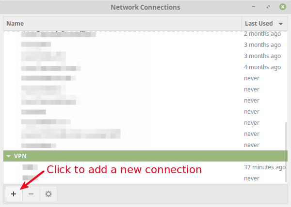
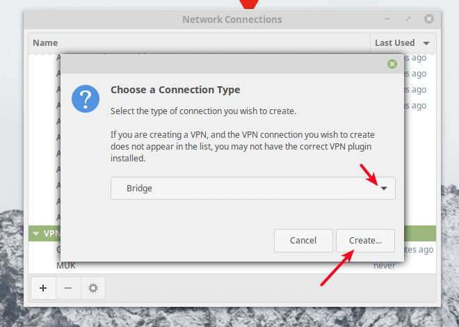
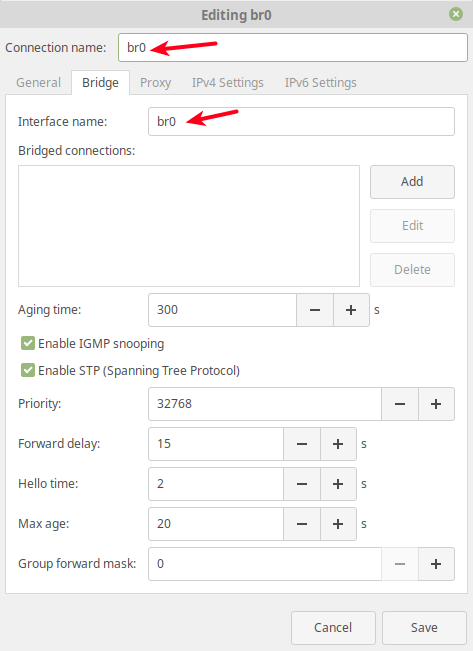
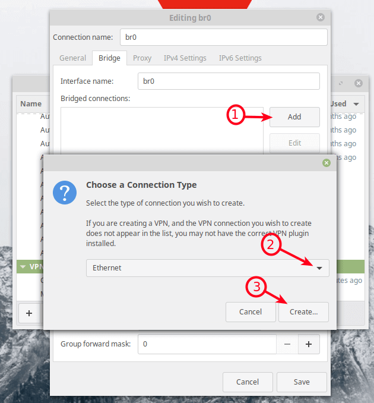
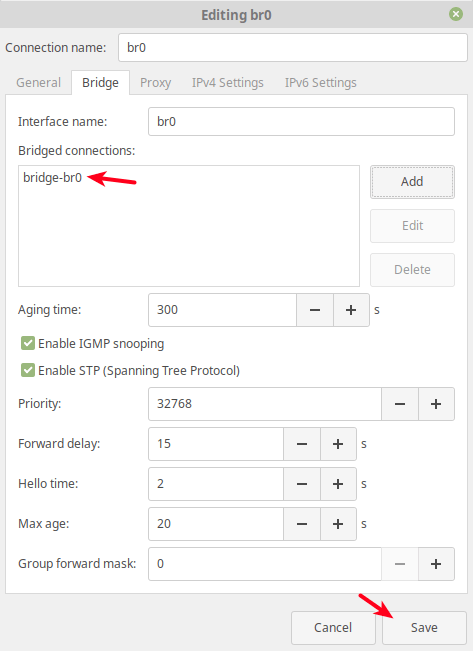
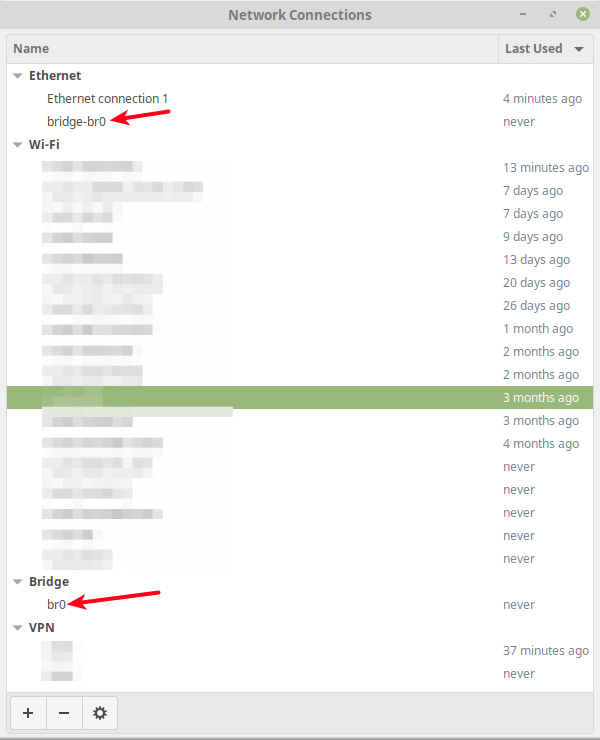

To open the nm-connection-editor application, run the following command from the terminal.

```bash
$ nm-connection-editor
```

From the network connections editor window, click on the + sign to add a new connection profile.



Next, choose the connection type as Bridge from the drop-down and click Create.




Next, set the bridge connection name and the interface name.



Then click the Add button to add the bridge slave ports i.e the Ethernet interface as shown in the following screenshot. Select Ethernet as the connection type and click Create.



Next, set the connection name according to your preference and click Save.


Under bridged connections, the new connection should now appear.



Now if you open the network connection editor once more, the new bridge interface and the slave interface should exist as indicated in the following screenshot.



Next, activate the bridge interface and deactivate the Ethernet interface, using the nmcli command.

```bash
$ sudo nmcli conn up br0
$ sudo nmcli conn down Ethernet\ connection\ 1
```