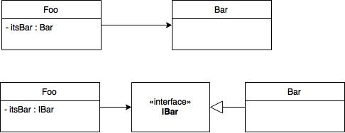
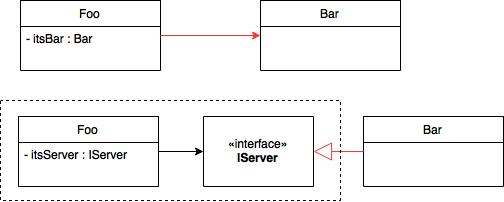
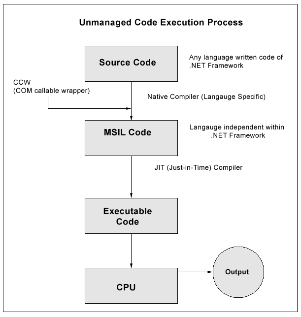
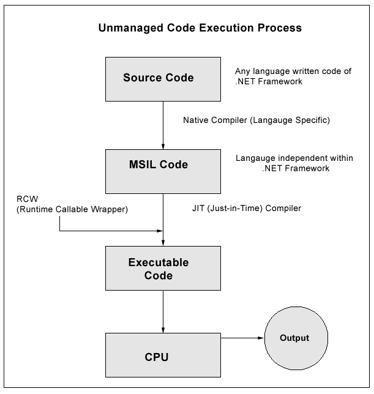
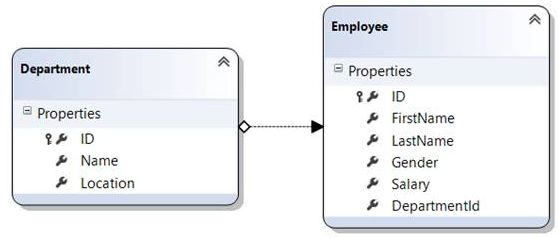
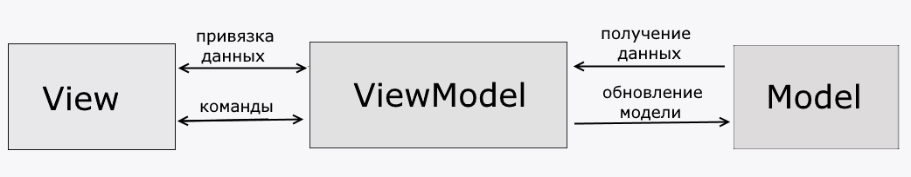

# Interview Junior/Middle developer

## Question 1

There are the following class A and B class declarations:

```c#
class A
{
    virtual void Foo()
    {
        Console.Write("Class A");
    }
}
class B: A
{
    override void Foo()
    {
        Console.Write("Class B");
    }
}
```

What will be output to the console by such calls to the Foo () method:

```c#
B obj1 = new A();
obj1.Foo();
 
B obj2 = new B();
obj2.Foo();
 
A obj3 = new B();
obj3.Foo();
```

**Response**

```c#
class A
{
    virtual void Foo() // virtual or abstract method cannot be private
    {
        Console.Write("Class A");
    }
}
class B: A
{
    override void Foo()
    {
        Console.Write("Class B");
    }
}
```

```c#
B obj1 = new A(); // cannot implicitly convert A to B. Impossible, because when creating an object of type B, 
                  // the constructor of class A is used. Class A does not inherit from class B,
                  // so its constructor cannot be used. There will be a compilation error.
obj1.Foo();
 
B obj2 = new B();
obj2.Foo(); // output  - Class B (Type B)
 
A obj3 = new B();
obj3.Foo(); // output  - Class B (Type A)
```

Methot was overriden in class A by class B (difference from hiding)

## Question 2

There is the following structure:

```c#
public struct S : IDisposable
{
    private bool dispose;
    public void Dispose()
    {
        dispose = true;
    }
    public bool GetDispose()
    {
        return dispose;
    }
}
```

What will be displayed in the following case:

```c#
var s = new S();
using (s)
{
    Console.WriteLine(s.GetDispose());
}
Console.WriteLine(s.GetDispose());
```

**Answer options:**
* true, true
* true, false
* false, true
* false, false

**Response**
* true, true
* true, false
* false, true
* <u>`false, false`</u>

Use of struct and mutable sctuct should be normally avoided. Struct is value type and should not hold unmanaged resources.

## Question 3

There is the following code:

```c#
List<Action> actions = new List<Action>();
for(var count=0; count<10; count++)
{
    actions.Add(() => Console.WriteLine(count));
}
foreach(var action in actions)
{
    action();
}
```

What will be displayed on the console?

**Answer options:**
* 0, 1, 2, 3, 4, 5, 6, 7, 8, 9
* 10, 10, 10, 10, 10, 10, 10, 10, 10, 10
* The code will throw an exception
* 0, 0, 0, 0, 0, 0, 0, 0, 0, 0, 0

**Response**
* 0, 1, 2, 3, 4, 5, 6, 7, 8, 9
* <u>`10, 10, 10, 10, 10, 10, 10, 10, 10, 10`</u>
* The code will throw an exception
* 0, 0, 0, 0, 0, 0, 0, 0, 0, 0, 0

## Question 4

What will be displayed on the console as a result of the following operations:

```c#
int i = 1;
object obj = i;
++i;
Console.WriteLine(i);
Console.WriteLine(obj);
Console.WriteLine((short)obj);
```

**Response**

```c#
int i = 1;
object obj = i; // assigned by val
++i;
Console.WriteLine(i); // i = 2
Console.WriteLine(obj); // obj = 1
Console.WriteLine((short)obj); // unable to cast int32 to int16
```

## Question 5

Which will output the following code to the console:

```c#
var s1 = string.Format ("{0}{1}", "abc", "cba");
var s2 = "abc" + "cba";
var s3 = "abccba";
 
Console.WriteLine (s1 == s2);
Console.WriteLine ((object) s1 == (object) s2);
Console.WriteLine (s2 == s3);
Console.WriteLine ((object) s2 == (object) s3);
```

**Answer options:**
* true, false, true, true
* true, true, true, true
* true, false, true, false
* true, false, false, false

**Response**
* <u>`true, false, true, true`</u>
* true, true, true, true
* true, false, true, false
* true, false, false, false

`s1` is created after compilation (during runtime) and s2 and s3 during compilation, so they pointing the same object different from s1.
This behavior is called `string interning`.

## Question 6

What results will the following code output:

```c#
 internal class Program
{
    private static Object syncObject = new Object();
    private static void Write()
    {
        lock (syncObject)
        {
            Console.WriteLine("test");
        }
    }
    static void Main(string[] args)
    {
        lock (syncObject)
        {
            Write();
        }
    }
}
```

**Answer options:**
* Will throw an exception
* Will print the word "test"
* A deadlock will occur.
* Will print the word "test" an infinite number of times

**Response**
* Will throw an exception
* <u>`Will print the word "test"`</u>
* A deadlock will occur.
* Will print the word "test" an infinite number of times

lock isn't necessary

## Question 7

The following classes are given:

```c#
public class A
{
    public virtual void Print1()
    {
        Console.Write("A");
    }
    public void Print2()
    {
        Console.Write("A");
    }
}
public class B: A
{
    public override void Print1()
    {
        Console.Write("B");
    }
}
public class C : B
{
    new public void Print2()
    {
        Console.Write("C");
    }
}
```

What result will the following code lead to:

```c#
var c = new C();
A a = c;
 
a.Print2();
a.Print1();
c.Print2();
```

**Answer options:**
* ABC
* CCC
* ACC
* AAC

**Response**
* <u>`ABC`</u>
* CCC
* ACC
* AAC

```c#
public class A
{
    public virtual void Print1()
    {
        Console.Write("A");
    }
    public void Print2()
    {
        Console.Write("A");
    }
}
public class B: A
{
    public override void Print1() // A method is overriden
    {
        Console.Write("B");
    }
}
public class C : B
{
    new public void Print2() // A new method is defined (hiding)
    {
        Console.Write("C");
    }
}
```

## Question 8

What will be displayed on the console as a result of executing the following code:

```c#
static IEnumerable<int> Square(IEnumerable<int> a)
{
    foreach(var r in a)
    {
        Console.WriteLine(r * r);
        yield return r * r;
    }
}
class Wrap
{
    private static int init = 0;
    public int Value
    {
        get { return ++init; }
    }
}
static void Main(string[] args)
{
    var w = new Wrap();
    var wraps = new Wrap[3];
    for(int i=0; i<wraps.Length; i++)
    {
        wraps[i] = w;
    }
 
    var values = wraps.Select(x => x.Value);
    var results = Square(values);
    int sum = 0;
    int count = 0;
    foreach(var r in results)
    {
        count++;
        sum += r;
    }
    Console.WriteLine("Count {0}", count);
    Console.WriteLine("Sum {0}", sum);
 
    Console.WriteLine("Count {0}", results.Count());
    Console.WriteLine("Sum {0}", results.Sum());
}
```

**Response**

```bash
1
4
9
Count 3
Sum 14
16
25
36
Count 3
49
64
81
Sum 194
```

Linq query is not executed immediatelly. All due to the fact that the wraps array is initialized with three values and the `return yield` iterator is used. The result is an array results dynamically renewable on each call. All the salt is in the iterator, the emphasis is on it. As a result, the whole point is that the LINQ query is not executed immediately, but when required, therefore the data is updated.

Yes, this is done using an iterator. Once you start iterating over the results array, the iterator will start returning items one at a time. This iteration is started implicitly by calling `results.Count()` or `results.Sum()` inside the implementations of these extension methods. Or, explicitly, a `foreach (var r in results).values` loop ​​is a decorating array on a wraps array. When accessing result, in essence, there is a call to values, since values ​​is an input parameter at the input to the function that creates result: `var results = Square(values);`. This call to values ​​triggers the "re-creation" of values ​​- the chain of decorators is resolved, but not at the entrance to the `Square` function, but inside it - when you start iterating along this chain by calling `foreach (var r in a)`. This is due to the fact that inside `Select` is also an iterator :), iterators interact perfectly with each other.

## Question 9

Is List a thread-safe collection?

**Answer options:**
* Read only
* Is not in any way
* For write operations only
* Is in all cases

**Response**
* <u>`Read only`</u>
* Is not in any way
* For write operations only
* Is in all cases

Source: [List<T> Class](https://docs.microsoft.com/en-us/dotnet/api/system.collections.generic.list-1?redirectedfrom=MSDN&view=netcore-3.1)

**Thread Safety**
Public static (Shared in Visual Basic) members of this type are thread safe. Any instance members are not guaranteed to be thread safe.

`It is safe to perform multiple read operations on a List<T>`, but issues can occur if the collection is modified while it's being read. To ensure thread safety, lock the collection during a read or write operation. To enable a collection to be accessed by multiple threads for reading and writing, you must implement your own synchronization. For collections with built-in synchronization, see the classes in the System.Collections.Concurrent namespace. For an inherently thread-safe alternative, see the ImmutableList<T> class.

That is, on the one hand, if the collection is read purely without changing, then it is thread-safe, but if we evaluate as a whole, then the List is not thread-safe even while reading.

## Question 10

What is the difference between the cast operator and the as operator?

**Answer options:**
* The "as" operator is just syntactic sugar for "cast"
* Cast changes the dynamic type, while as changes the static type
* If an error occurs, the cast throws an InvalidCastException and the as operator returns null
* On error, cast returns null, and the as operator throws an InvalidCastException

**Response**
* The "as" operator is just syntactic sugar for "cast"
* Cast changes the dynamic type, while as changes the static type
* If an error occurs, the cast throws an InvalidCastException and the as operator returns null
* On error, cast returns null, and the as operator throws an InvalidCastException

`as` operator would not raise an error but `cast` will raise an error of `InvalidCastException`

From MSDN

The as operator is like a cast except that it yields null on conversion failure instead of raising an exception.

`expression as type`

is equivalent to:

`expression is type ? (type)expression : (type)null`

except that expression is evaluated only once.

>Note that the as operator only performs reference conversions and boxing conversions. The as operator cannot perform other conversions, such as user-defined conversions, which should instead be performed using `cast` expressions.

## Question 11

What is the algorithmic complexity for read and write operations for a Dictionary collection?

**Answer options:**
* Reading - O(1), writing - O(1)
* Reading - O(n), writing - O(1)
* Reading is O(n), writing is O(n)
* Reading - O(1), writing - O(n)

**Response**
* Reading - O(1), writing - O(1)
* Reading - O(n), writing - O(1)
* Reading is O(n), writing is O(n)
* <u>`Reading - O(1), writing - O(n)`</u>

Sources: [Dictionary<TKey,TValue> Class](https://docs.microsoft.com/en-us/dotnet/api/system.collections.generic.dictionary-2?redirectedfrom=MSDN&view=netcore-3.1), [Dictionary<TKey,TValue>.Add(TKey, TValue) Method](https://docs.microsoft.com/en-us/dotnet/api/system.collections.generic.dictionary-2.add?redirectedfrom=MSDN&view=netcore-3.1#System_Collections_Generic_Dictionary_2_Add__0__1_)

Retrieving a value by using its key is very fast, close to O(1), because the Dictionary<tkey, tvalue> class is implemented as a hash table.

If Count is less than the capacity, this method approaches an O(1) operation. If the capacity must be increased to accommodate the new element, this method becomes an O(n) operation, where n is Count.

## Question 12

What is the difference between the "ref" and "out" keywords?

**Answer options:**
* The parameter with the ref keyword may not be initialized, and the parameter with the out keyword must be initialized before calling the method that uses these parameters
* The parameter with the out keyword may not be initialized, and the parameter with the ref keyword must be initialized before calling the method that uses these parameters
* No difference
* The ref keyword can only be used with value types, and out can be used with both value and reference types.

**Response**
* The parameter with the ref keyword may not be initialized, and the parameter with the out keyword must be initialized before calling the method that uses these parameters
* <u>`The parameter with the out keyword may not be initialized, and the parameter with the ref keyword must be initialized before calling the method that uses these parameters`</u>
* No difference
* The ref keyword can only be used with value types, and out can be used with both value and reference types.

## Question 13

What will be the result of calling the following code:

```c#
static void Main(string[] args)
{
    object sync = new object();
    var thread = new Thread(()=>
    {
        try
        {
            Work();
        }
        finally
        {
            lock (sync)
            {
                Monitor.PulseAll(sync);
            }
        }
    });
    thread.Start();
    lock (sync)
    {
        Monitor.Wait(sync);
    }
    Console.WriteLine("test");
}
private static void Work()
{
    Thread.Sleep(1000);
}
```

**Answer options:**
* SynchronizationLockException will be thrown
* The word "test" will not be printed as a deadlock will occur
* In some cases the word "test" may be printed, and in others a deadlock may occur
* The word "test" will always be printed

**Response**
* SynchronizationLockException will be thrown
* The word "test" will not be printed as a deadlock will occur
* In some cases the word "test" may be printed, and in others a deadlock may occur
* <u>`The word "test" will always be printed`</u>

In fact, everything can be understood from the description of the methods themselves:
`Monitor.Wait(Object)` - Releases the `lock` on the object and blocks the current thread until it acquires the `lock` again.
That is, at this step, the `lock` is released, and the main thread waits for a call to `Pulse` or `PulseAll`.
After a second, the second thread successfully acquires the `lock` and calls `PulseAll`.
Then the first thread continues execution as usual.

## Question 14

What is the result of the following code:

```c#
class MyCustomException : DivideByZeroException
{
 
}
static void Main(string[] args)
{
    try
    {
        Calc();
    }
    catch (MyCustomException e)
    {
        Console.WriteLine("Catch MyCustomException");
        throw;
    }
    catch (DivideByZeroException e)
    {
        Console.WriteLine("Catch Exception");
    }
    Console.ReadLine();
}
 
private static void Calc()
{
    int result = 0;
    var x = 5;
    int y = 0;
    try
    {
        result = x / y;
    }
    catch (MyCustomException e)
    {
        Console.WriteLine("Catch DivideByZeroException");
        throw;
    }
    catch (Exception e)
    {
        Console.WriteLine("Catch Exception");
    }
    finally
    {
        throw new MyCustomException();
    }
}
```

**Answer options:**
* Catch DivideByZeroException, Catch MyCustomException
* Catch Exception, Catch MyCustomException
* Catch DivideByZeroException, Catch DivideByZeroException
* Catch Exception, Catch DivideByZeroException

**Response**
* Catch DivideByZeroException, Catch MyCustomException
* <u>`Catch Exception, Catch MyCustomException`</u> + <u>`unhandled exception`</u>
* Catch DivideByZeroException, Catch DivideByZeroException
* Catch Exception, Catch DivideByZeroException

```c#
class MyCustomException : DivideByZeroException
{
 
}
static void Main(string[] args)
{
    try
    {
        Calc();
    }
    catch (MyCustomException e) // 2.
    {
        Console.WriteLine("Catch MyCustomException");
        throw; // 3. unhandled exception
    }
    catch (DivideByZeroException e)
    {
        Console.WriteLine("Catch Exception");
    }
    Console.ReadLine();
}
 
private static void Calc()
{
    int result = 0;
    var x = 5;
    int y = 0;
    try
    {
        result = x / y;
    }
    catch (MyCustomException e)
    {
        Console.WriteLine("Catch DivideByZeroException");
        throw;
    }
    catch (Exception e) // 1.
    {
        Console.WriteLine("Catch Exception");
    }
    finally // 2.
    {
        throw new MyCustomException();
    }
}
```

## Question 15

What is the difference between optional and named parameters?

**Response**

Source: [Named and Optional Arguments (C# Programming Guide)](https://docs.microsoft.com/en-us/dotnet/csharp/programming-guide/classes-and-structs/named-and-optional-arguments#:~:text=In%20this%20article&text=C%23%204%20introduces%20named%20and,omit%20arguments%20for%20some%20parameters.)

Named arguments enable you to specify an argument for a parameter by matching the argument with its name rather than with its position in the parameter list.
Them also improve the readability of your code by identifying what each argument represents.

Optional arguments enable you to omit arguments for some parameters.
Each optional parameter has a default value as part of its definition. If no argument is sent for that parameter, the default value is used.
Optional parameters are defined at the end of the parameter list, after any required parameters. If the caller provides an argument for any one of a succession of optional parameters, it must provide arguments for all preceding optional parameters.

## Question 16
How are the String and StringBuilder classes different from each other? Why is this separation necessary?

**Response**

Source: [C# | String vs StringBuilder](https://www.geeksforgeeks.org/c-sharp-string-vs-stringbuilder/)

StringBuilder is used to represent a mutable string of characters. Mutable means the string which can be changed. So String objects are immutable but StringBuilder is the mutable string type. It will not create a new modified instance of the current string object but do the modifications in the existing string object. The complete functionality of StringBuilder is provided by StringBuilder class which is present in System.Text namespace.

As stated above that the String class objects are immutable which means that if the user will modify any string object it will result into the creation of a new string object. It makes the use of string costly. So when the user needs the repetitive operations on the string then the need of StringBuilder come into existence. It provides the optimized way to deal with the repetitive and multiple string manipulation operations.

When to use which one:

If a string is going to remain constant throughout the program, then use String class object because a String object is immutable.
If a string can change (example: lots of logic and operations in the construction of the string) then using a StringBuilder is the best option.

## Question 17

What is the difference between value and reference types?

**Response**

Source: [Difference between a Value Type and a Reference Type](http://net-informations.com/faq/general/valuetype-referencetype.htm#:~:text=A%20Value%20Type%20holds%20the,are%20stored%20in%20the%20stack.)

A Value Type stores its contents in memory allocated on the stack. When you created a Value Type, a single space in memory is allocated to store the value and that variable directly holds a value. If you assign it to another variable, the value is copied directly and both variables work independently. Predefined datatypes, structures, enums are also value types, and work in the same way. Value types can be created at compile time and Stored in stack memory, because of this, Garbage collector can't access the stack.

Reference Types are used by a reference which holds a reference (address) to the object but not the object itself. Because reference types represent the address of the variable rather than the data itself, assigning a reference variable to another doesn't copy the data. Instead it creates a second copy of the reference, which refers to the same location of the heap as the original value. Reference Type variables are stored in a different area of memory called the heap. This means that when a reference type variable is no longer used, it can be marked for garbage collection. Examples of reference types are Classes, Objects, Arrays, Indexers, Interfaces etc.

## Question 18

How and why to use the using construct in C#?

**Response**

Source: [using statement (C# Reference)](https://docs.microsoft.com/en-us/dotnet/csharp/language-reference/keywords/using-statement)

Provides a convenient syntax that ensures the correct use of `IDisposable` objects. Beginning in C# 8.0, the `using` statement ensures the correct use of `IAsyncDisposable` objects

The `using` statement ensures that `Dispose` (or `DisposeAsync`) is called even if an exception occurs within the `using` block. You can achieve the same result by putting the object inside a `try` block and then calling `Dispose` (or `DisposeAsync`) in a `finally` block; in fact, this is how the `using` statement is translated by the compiler. 


## Question 19

What is the difference between using Finalize and Dispose?

**Response**

The `Finalize` method is called when your object is `garbage collected` and you have no guarantee when this will happen (you can force it, but it will hurt performance).

The `Dispose` method on the other hand is meant to be called by the code that created your class so that you can clean up and release any resources you have acquired (unmanaged data, database connections, file handles, etc) the moment the code is done with your object.

The standard practice is to implement `IDisposable` and `Dispose` so that you can use your object in a `using` statment. Such as `using(var foo = new MyObject()) { }`. And in your `finalizer`, you call `Dispose`, just in case the calling code forgot to dispose of you. You need to be a bit careful about calling Dispose from your Finalize implementation - `Dispose` may also dispose managed resources, which you don't want to touch from your `finalizer`, as they may already have been finalized themselves.


Source: [Back To Basics - Dispose Vs Finalize](https://www.c-sharpcorner.com/UploadFile/nityaprakash/back-to-basics-dispose-vs-finalize/)

Garbage collector (GC) plays the main and important role in .NET for memory management so programmer can focus on the application functionality. Garbage collector is responsible for releasing the memory (objects) that is not being used by the application. But GC has limitation that, it can reclaim or release only memory which is used by managed resources. There are a couple of resources which GC is not able to release as it doesn't have information that, how to claim memory from those resources like `File handlers`, `window handlers`, `network sockets`, `database connections` etc. If your application these resources than it's programs responsibility to release unmanaged resources. For example, if we open a file in our program and not closed it after processing than that file will not be available for other operation or it is being used by other application than they can not open or modify that file. For this purpose `FileStream` class provides `Dispose` method. We must call this method after file processing finished. Otherwise it will through exception Access Denied or file is being used by other program.

Finalize method can not be called explicitly in the code. Only Garbage collector can call the the Finalize when object become inaccessible. Finalize method cannot be implemented directly it can only be implement via declaring destructor. It is recommend that implement Finalize and Dispose method together if you need to implement Finalize method.

Finalize is bit expensive to use. It doesn't clean the memory immediately. When application runs, Garbage collector maintains a separate queue/array when it adds all object which has finalized implemented. Other term GC knows which object has Finalize implemented. When the object is ready to claim memory, Garbage Collector call finalize method for that object and remove from the collection. In this process it just clean the memory that used by unmanaged resource. Memory used by managed resource still in heap as inaccessible reference. That memory release, whenever Garbage Collector run next time. Due to finalize method GC will not clear entire memory associated with object in fist attempt.

It is always recommended that, one should not implement the Finalize method until it is extremely necessary. First priority should always be to implement the Dispose method and clean unmanaged as soon as possible when processing finish with that.

## Question 20

What are the main differences between a class and a structure in C#?

**Response**

Source: [Choosing Between Class and Struct](https://docs.microsoft.com/en-us/dotnet/standard/design-guidelines/choosing-between-class-and-struct)

Reference types are allocated on the heap and garbage-collected, whereas value types are allocated either on the stack or inline in containing types and deallocated when the stack unwinds or when their containing type gets deallocated. Therefore, allocations and deallocations of value types are in general cheaper than allocations and deallocations of reference types.

Arrays of reference types are allocated out-of-line, meaning the array elements are just references to instances of the reference type residing on the heap. Value type arrays are allocated inline, meaning that the array elements are the actual instances of the value type. Therefore, allocations and deallocations of value type arrays are much cheaper than allocations and deallocations of reference type arrays. In addition, in a majority of cases value type arrays exhibit much better locality of reference.

The next difference is related to memory usage. Value types get boxed when cast to a reference type or one of the interfaces they implement. They get unboxed when cast back to the value type. Because boxes are objects that are allocated on the heap and are garbage-collected, too much boxing and unboxing can have a negative impact on the heap, the garbage collector, and ultimately the performance of the application. In contrast, no such boxing occurs as reference types are cast. ([For more information, see Boxing and Unboxing](https://docs.microsoft.com/en-us/dotnet/csharp/programming-guide/types/boxing-and-unboxing)).

> Boxing is the process of converting a value type to the type object or to any interface type implemented by this value type. When the common language runtime (CLR) boxes a value type, it wraps the value inside a System.Object instance and stores it on the managed heap. Unboxing extracts the value type from the object. Boxing is implicit; unboxing is explicit. The concept of boxing and unboxing underlies the C# unified view of the type system in which a value of any type can be treated as an object.
>
> In the following example, the integer variable i is boxed and assigned to object o.
> ```c#
> int i = 123;
> // The following line boxes i.
> object o = i;
> ```
>
> The object o can then be unboxed and assigned to integer variable i:
> ```c#
> o = 123;
> i = (int)o;  // unboxing
> ```

Next, reference type assignments copy the reference, whereas value type assignments copy the entire value. Therefore, assignments of large reference types are cheaper than assignments of large value types.

Finally, reference types are passed by reference, whereas value types are passed by value. Changes to an instance of a reference type affect all references pointing to the instance. Value type instances are copied when they are passed by value. When an instance of a value type is changed, it of course does not affect any of its copies. Because the copies are not created explicitly by the user but are implicitly created when arguments are passed or return values are returned, value types that can be changed can be confusing to many users. Therefore, value types should be immutable.

As a rule of thumb, the majority of types in a framework should be classes. There are, however, some situations in which the characteristics of a value type make it more appropriate to use structs.

CONSIDER defining a struct instead of a class if instances of the type are small and commonly short-lived or are commonly embedded in other objects.

AVOID defining a struct unless the type has all of the following characteristics:
* It logically represents a single value, similar to primitive types (int, double, etc.).
* It has an instance size under 16 bytes.
* It is immutable.
* It will not have to be boxed frequently.
* In all other cases, you should define your types as classes.

Source: [Structure types (C# reference)](https://docs.microsoft.com/en-us/dotnet/csharp/language-reference/builtin-types/struct)

Typically, you use structure types to design small data-centric types that provide little or no behavior. For example, .NET uses structure types to represent a number (both integer and real), a Boolean value, a Unicode character, a time instance. If you're focused on the behavior of a type, consider defining a class. Class types have reference semantics. That is, a variable of a class type contains a reference to an instance of the type, not the instance itself.

Because structure types have value semantics, we recommend you to define immutable structure types.

## Question 21

How can you compare strings in C#?

**Response**

Source: [How to compare strings in C#](https://docs.microsoft.com/en-us/dotnet/csharp/how-to/compare-strings), [How To Compare Strings In C#
](https://www.c-sharpcorner.com/UploadFile/mahesh/compare-strings-in-C-Sharp/)

Default ordinal comparisons
By default, the most common operations:
* `String.CompareTo`
* `String.Equals`
* `String.Equality` and `String.Inequality`, that is, equality operators `==` and `!=`, respectively

The default ordinal comparison doesn't take linguistic rules into account when comparing strings. It compares the binary value of each Char object in two strings. As a result, the default ordinal comparison is also case-sensitive.

**Using String.Equals**

The simplest form of comparting two string for the same value is using `String.Equals` method. If both strings are equal, the method returns `true`; else returns `false`.

**Using String.Compare**

`String.Compare` method compares two strings and returns an integer value. The return value of the Compare method can be `less than zero`, `greater than zero` or `equals to zero`.

|Value|Condition|
|:-|:-|
|Less than zero|strA precedes strB in the sort order.|
|Zero|strA is in the same position as strB in the sort order.|
|Greater than zero|strA follows strB in the sort order.|

**Using CompareTo Method**

`CompareTo` method is an instance method of string class. It compares a value (either a string or on object) with a string instance. Return values of this method are same as the `Compare` method.

Because the default comparison methods often perform different types of comparisons, we recommend that you always make the intent of your code clear by calling an overload that explicitly specifies the type of comparison to perform.

**StringComparison**

||||
|:-|:-|:-|
|CurrentCulture|0|Compare strings using culture-sensitive sort rules and the current culture.|
|CurrentCultureIgnoreCase|1|Compare strings using culture-sensitive sort rules, the current culture, and ignoring the case of the strings being compared.|
|InvariantCulture|2|Compare strings using culture-sensitive sort rules and the invariant culture.|
|InvariantCultureIgnoreCase|3|Compare strings using culture-sensitive sort rules, the invariant culture, and ignoring the case of the strings being compared.|
|Ordinal|4|Compare strings using ordinal (binary) sort rules.|
|OrdinalIgnoreCase|5|Compare strings using ordinal (binary) sort rules and ignoring the case of the strings being compared.|

## Question 22

What are managed code and the CLR? Basic requirements for managed code.

**Response**

Sources: [What is "managed code"?](https://docs.microsoft.com/en-us/dotnet/standard/managed-code), [Difference between Managed and Unmanaged code in .NET
](https://www.tutorialspoint.com/difference-between-managed-and-unmanaged-code-in-net)

To put it very simply, managed code is just that: code whose execution is managed by a runtime. In this case, the runtime in question is called the Common Language Runtime or CLR, regardless of the implementation (Mono or .NET Framework or .NET Core). CLR is in charge of taking the managed code, compiling it into machine code and then executing it. On top of that, runtime provides several important services such as automatic memory management, security boundaries, type safety etc.

|Key|Managed Code|Unmanaged code|
|:-|:-|:-|
|Executed By|Executed by CLR, Common Language Runtime, also named as Managed Runtime Environment.|Executed by Operating System directly on the underlying hardware.|
|Security|CLR handles security concerns and provides inbuilt security to code written in .NET.|No inbuilt security present. It is developer's responsibility to write safe and secure code.|
|Memory Overflow|Memory buffer overflow never happens, as CLR handles memory allocation and deallocation automatically.|Memory buffer overflow can occur and can hamper the program execution badly.|
|Runtime Services|CLR provides automatic garbage collection, exception handling to managed code.|No automatic garbage collection and other services are provided to unmanaged code.|
|Output|Managed Code is converted to IL, Intermiddiate Language also termed as CIL of MSIL.|Unmanaged Code is converted to native language code.|
|Low Level Access|Programmer has no low level access using Managed Code.|Programmer can write low level access code using unmanaged code.|

## Question 23

Difference between IEnumerable<T> and IQueryable<T> when working with remote DB?

**Response**

The difference is that `IQueryable<T>` is the interface that allows `LINQ-to-SQL (LINQ.-to-anything really)` to work. So if you further refine your query on an `IQueryable<T>`, that query will be executed in the database, if possible.

For the `IEnumerable<T>` case, it will be `LINQ-to-object`, meaning that all objects matching the original query will have to be loaded into memory from the database.

This is quite an important difference, and working on `IQueryable<T>` can in many cases save you from returning too many rows from the database. Another prime example is doing paging: If you use `Take` and `Skip` on `IQueryable`, you will only get the number of rows requested; doing that on an `IEnumerable<T>` will cause all of your rows to be loaded in memory.

## Question 24

What is abstraction and how does it relate to OOP?

**Response**

Its main goal is to handle complexity by hiding unnecessary details from the user. That enables the user to implement more complex logic on top of the provided abstraction without understanding or even thinking about all the hidden complexity.

## Question 25
What is IoC (Inversion of Control) and what is it for?

**Response**

Source: [Инверсии зависимостей управления впрыском](https://habr.com/ru/post/321344/)

Inversion of Control (IoC) is a design principle (although, some people refer to it as a pattern). As the name suggests, it is used to invert different kinds of controls in object-oriented design to achieve loose coupling.

Inversion of Control is too generic a term, and thus people find it confusing. As a result with a lot of discussion with various IoC advocates we settled on the name Dependency Injection.

The concept of IoC is closely related to the concept of a `framework`. This is the main characteristic that distinguishes it from another way of formatting reusable code whose functions you simply call from your program - `library`. A `framework`, on the other hand, is an external `frame or rack` that provides predefined extension points. At these extension points you insert your code, but when it is called it is the framework that determines.

**Dependency Inversion**
This is the very letter D in the abbreviation SOLID - a principle that says that:
* higher-level modules should not depend on lower-level modules. Both types of modules must depend on abstractions;
* abstractions should not depend on details. The details should depend on the abstraction.

The wording is a bit confusing, so let's look at the following example (I'll use C # for the examples):

```c#
public class Foo {
  private Bar _bar;

  public Foo() {
     _bar = new Bar();
  }
}
```

The problem here is that the Foo class depends on the specific `Bar` class. For one reason or another - for the sake of extensibility, reusability, or testability for the sake of - the challenge may arise to separate them. According to the principle of `dependency inversion`, for this, an intermediate abstraction should be introduced between them.

```c#
public class Foo {
  private IBar _bar;

  public Foo() {
     _bar = new Bar();
  }
}
```

The UML diagram clearly demonstrates both options.



Difficulties begin when you ask, where is the inversion here, in fact? The basic idea, without which it is impossible to answer this question, is that interfaces do not belong to their implementations, but to the clients using them. The name of the `IBar` interface is misleading and forces you to consider the bundle `IBar` + `Bar` as a whole. At the same time, the true owner of `IBar` is the `Foo` class, and if you take this into account, the direction of the relationship between `Foo` and `Bar` is really reversed.



**Dependency Injection**

Looking at the resulting code, the attentive reader will, of course, notice that even though the intermediate abstraction has been introduced, the `Foo` class is still responsible for instantiating the `Bar` class. Obviously, this is not quite the division that could be expected.

```c#
public class Foo {
  private IServer _server;

  public Foo() {
     _server = new Bar();
  }
}
```

To save the Foo class from such an unpleasant responsibility, it would be good to move the instantiation code somewhere else and `encapsulate` it there (since we are all extremely pragmatic and do not like to write anything twice). This can be done in two ways - using either `Service Locator` or `Dependency Injection`.

The `Service Locator` is such a registry for matching abstractions and their implementations. You feed it the interface you are interested in, and in return you get a ready-made instance of a concrete class. It looks like this:

```c#
public class Foo {
  private IServer _server;

  public Foo() {
     _server = ServiceLocator.Resolve<IServer>();
  }
}
```

The nuance is that the `Foo` class is now completely independent of the `Bar` class, but still manages its instantiation. As we already know, this can be avoided by inverting the control flow, i.e. transferring this control into the hands of some external mechanism. `Dependency Injection` is such a mechanism, implemented in the form of frameworks called `IoC` containers:

```c#
public class Foo {
  private IServer _server;

  public Foo(IServer server) {
     _server = server;
  }
}
```

**Conclusion**

In fact, the IoC container is such a stupid name that it’s even difficult to think of something worse offhand. It says absolutely nothing about what it is actually doing, misleading dozens of more and more new programmers every day. Absolutely any framework can be called an IoC container, as it implements inversion of control by definition and is a wrapper for some general-purpose code. This term was (and continues to be) so disgusting that [Martin Fowler](https://martinfowler.com/) came up with another - dependency injection.

Let's summarize. We use `Dependency Inversion` to separate modules by abstraction, `Dependency Injection` to get rid of manual instantiation, and we implement this through a framework built on the principle of `Inversion of Control`. And none of these are synonymous, which is why `IoC containers` are a prime example of how you can completely confuse everyone with a single unfortunate term.

I hope that in this little opus I managed to convey to you the difference between these things, and you will never confuse them again. And if one of your colleagues confuses, then you can simply and clearly explain to them what they are wrong about.

## Question 26
What is DI (Dependency Injection) container?

A DI Container is a framework to create dependencies and inject them automatically when required. It automatically creates objects based on the request and injects them when required. DI Container helps us to manage dependencies within the application in a simple and easy way.

You register everything that'll need to be resolved with the container in the composition root. That is to say when your program starts up is when everything should be registered.

Let's say we have the following code:

```c#
public class MyClass
{
    public Run()
    {
        var dependency = new Dependency1();
        dependency.DoSomething();
    }
}

public class Dependency1
{
    public void DoSomething()
    {
        var dependency = new Dependency2();
        dependeny.DoSomethingElse();
    }
}

public class Dependency2
{
    public void DoSomethingElse()
    {
    }
}
```

This gives us the above dependency chain: MyClass -> Dependency1 -> Dependency2.

The first thing we should do is refactor the classes to take their dependencies through their constructor and rely on interfaces rather than concretions. We can't inject dependencies unless there is a place to inject them (constructor, property, etc).

Here is the refactored code:

```c#
public interface IMyClass
{
    void Run();
}

public interface IDependency1
{
    void DoSomething();
}

public interface IDependency2
{
    void DoSomethingElse();
}

public class MyClass : IMyClass
{
    public readonly IDependency1 _dep;

    public MyClass(IDependency1 dep)
    {
        _dep = dep;
    }

    public void Run()
    {
        _dep.DoSomething();
    }
}

public class Dependency1 : IDependency1
{
    public readonly IDependency2 _dep;

    public MyClass(IDependency2 dep)
    {
        _dep = dep;
    }

    public void DoSomething()
    {
        _dep.DoSomethingElse();
    }
}

public class Dependency2 : IDependency2
{
    public void DoSomethingElse()
    {
    }
}
```

You'll notice the classes now all take their dependencies through their constructors and do not new up anything. Classes should only take in dependencies that they actually need. For example, MyClass does not NEED a Dependency2 so it doesn't ask for one. It only asks for a Dependency1 because that's all it needs. Dependency1 NEEDS Dependency2, not MyClass.

Now to wire it all up `WITHOUT` a container we would just new it all up in the composition root:

```c#
void Main()
{
    var myClass = new MyClass(new Dependency1(new Dependency2()));
}
```

You can see how that could get cumbersom if we had tons of classes and depdencies. That's why we use a container. It handles all the depdency graph for us. With a container we'd rewrite it as follows:

```c#
void Main()
{
    // the order of our registration does not matter.
    var container = new Container();
    container.Register<IDependency1>.For<Dependency1>();
    container.Register<IDependency2>.For<Dependency2>();
    container.Register<IMyClass>.For<MyClass>();

    // then we request our first object like in the first example (MyClass);
    var myClass = container.Resolve<IMyClass>();

    myClass.Run();
}
```

In the second example the container will handle wiring up all the dependencies. So we never need to pass Depedency2 to MyClass and then to Depedency1. We only need to request it in Dependency1 and the container will wire it up for us like in the first example.

`Container` as a `Service Locator` This should be generally avoided but if you want to use the container as a service locator you have two options:
*  Pass the container into your classes that need it through the constructor. You can use the above examples for wiring your classes up for DI. But instead of requesting a dependency like IDependency in the constructor you just pass the container.

```c#
public class Game : IGame
{
    public Game(IContainer container)
    {
        var blah = container.Resolve<IBlah>();
    }
}
```

* Request your container through a static class:

```c#
public static class ServiceLocator
{
    private static IContainer container;
    public static IContainer Container
    {
        get 
        {
            if (container == null)
            {
                container = new Container();
            }

            return container;
        }
    }
}
```

* Register everything as normal in your composition root using the ServiceLocator class. Then to use:

```c#
public class MyClass
{
    public void DoSomething()
    {
        var blah = ServiceLocator.Container.Resolve<IBlah>();
    }
}
```


## Question 27

What implementations of DI containers do you know in C#. Which DI container is the best?

**Response**

* ASP.NET Core
* Unity
* Autofac

Sources: [The Ultimate List of .NET Dependency Injection Frameworks](https://www.claudiobernasconi.ch/2019/01/24/the-ultimate-list-of-net-dependency-injection-frameworks/), [Dependency injection in ASP.NET Core](https://docs.microsoft.com/en-us/aspnet/core/fundamentals/dependency-injection?view=aspnetcore-3.1)

The best is which one you knows better.

## Question 28
What is meant by properties in C #?

**Response**

Source: [Properties (C# Programming Guide)](https://docs.microsoft.com/en-us/dotnet/csharp/programming-guide/classes-and-structs/properties)

A property is a member that provides a flexible mechanism to read, write, or compute the value of a private field. Properties can be used as if they are public data members, but they are actually special methods called accessors. This enables data to be accessed easily and still helps promote the safety and flexibility of methods.

Properties overview:
* Properties enable a class to expose a public way of getting and setting values, while hiding implementation or verification code.
* A [get](https://docs.microsoft.com/en-us/dotnet/csharp/language-reference/keywords/get) property accessor is used to return the property value, and a [set](https://docs.microsoft.com/en-us/dotnet/csharp/language-reference/keywords/set) property accessor is used to assign a new value. These accessors can have different access levels. For more information, see [Restricting Accessor Accessibility](https://docs.microsoft.com/en-us/dotnet/csharp/programming-guide/classes-and-structs/restricting-accessor-accessibility).
* The [value](https://docs.microsoft.com/en-us/dotnet/csharp/language-reference/keywords/value) keyword is used to define the value being assigned by the `set` accessor.
* Properties can be *read-write* (they have both a `get` and a `set` accessor), *read-only* (they have a `get` accessor but no `set` accessor), or *write-only* (they have a `set` accessor, but no `get` accessor). Write-only properties are rare and are most commonly used to restrict access to sensitive data.
* Simple properties that require no custom accessor code can be implemented either as expression body definitions or as [auto-implemented properties](https://docs.microsoft.com/en-us/dotnet/csharp/programming-guide/classes-and-structs/auto-implemented-properties).

## Question 29

What is an assembly manifest?

**Response**

Source: [.Net Assembly Manifest](http://vb.net-informations.com/framework/assembly_manifest.htm)

An Assembly Manifest is a file that containing Metadata about .NET Assemblies. Assembly Manifest contains a collection of data that describes how the elements in the assembly relate to each other. It describes the relationship and dependencies of the components in the Assembly, versioning information, scope information and the security permissions required by the Assembly.

The Assembly Manifest can be stored in Portable Executable (PE) file with Microsoft Intermediate Language (MSIL) code. You can add or change some information in the Assembly Manifest by using assembly attributes in your code. The Assembly Manifest can be stored in either a PE file (an .exe or .dll) with Microsoft Intermediate Language (MSIL) code or in a standalone PE file that contains only assembly manifest information. Using ILDasm, you can view the manifest information for any managed DLL.

> Note. Metadata in .Net is binary information which describes the characteristics of a resource . This information include Description of the Assembly, Data Types and members with their declarations and implementations, references to other types and members, Security permissions etc. A module's metadata contains everything that needed to interact with another module.

## Question 30
What is the GAC? Is it possible to put two files with the same name in the Global Assembly Cache?

**Response**

Source: [Global Assembly Cache](https://docs.microsoft.com/en-us/dotnet/framework/app-domains/gac)

Each computer where the Common Language Runtime is installed has a machine-wide code cache called the Global Assembly Cache. The Global Assembly Cache stores assemblies specifically designated to be shared by several applications on the computer.

As long as the version number is different (which would be required) it is possible to put two files with the same name in the Global Assembly Cache.

## Question 31

What access modifiers are there in C#?

**Response**

Source: [Access Modifiers in C#](https://www.geeksforgeeks.org/access-modifiers-in-c-sharp/), [](https://docs.microsoft.com/en-us/dotnet/csharp/programming-guide/classes-and-structs/access-modifiers)

Access Modifiers are keywords that define the accessibility of a member, class or datatype in a program. These are mainly used to restrict unwanted data manipulation by external programs or classes. There are 4 access modifiers (public, protected, internal, private) which defines the 6 accessibility levels as follows:
* public - The type or member can be accessed by any other code in the same assembly or another assembly that references it.
* protected - The type or member can be accessed only by code in the same `class`, or in a `class` that is derived from that class.
* internal - The type or member can be accessed by any code in the same assembly, but not from another assembly.
* protected internal - The type or member can be accessed by any code in the assembly in which it's declared, or from within a derived `class` in another assembly.
* private - The type or member can be accessed only by code in the same `class` or `struct`.
* private protected - The type or member can be accessed only within its declaring assembly, by code in the same `class` or in a type that is derived from that `class`.

The Accessibility table of these modifiers is given below:

||PUBLIC|PROTECTED|INTERNAL|PROTECTED INTERNAL|PRIVATE|PRIVATE PROTECTED|
|:-|:-|:-|:-|:-|:-|:-|
|Entire program|Yes|No|No|No|No|No|
|Containing class|Yes|Yes|Yes|Yes|Yes|Yes|
|Current assembly|Yes|No|Yes|Yes|No|No|
|Derived types|Yes|Yes|No|Yes|No|No|
|Derived types within current assembly|Yes|Yes|Yes|Yes|No|Yes|

**public Accessibility Level**

Access is granted to the entire program. This means that another method or another assembly which contains the class reference can access these members or types. This access modifier has the most permissive access level in comparison to all other access modifiers.

**protected Accessibility Level**

Access is limited to the class that contains the member and derived types of this class. It means a class which is the subclass of the containing class anywhere in the program can access the protected members.

**internal Accessibility Level**

Access is limited to only the current Assembly, that is any class or type declared as internal is accessible anywhere inside the same namespace. It is the **default access modifier in C#**.

**protected internal Accessibility Level**

Access is limited to the current assembly or the derived types of the containing class. It means access is granted to any class which is derived from the containing class within or outside the current Assembly.

**private Accessibility Level**

Access is only granted to the containing class. Any other class inside the current or another assembly is not granted access to these members.

**private protected Accessibility Level**

Access is granted to the containing class and its derived types present in the current assembly. This modifier is valid in C# version 7.2 and later.

## Question 32

What are Boxing and Unboxing?

**Response**

([Boxing and Unboxing](https://docs.microsoft.com/en-us/dotnet/csharp/programming-guide/types/boxing-and-unboxing)).

Boxing is the process of converting a value type to the type object or to any interface type implemented by this value type. When the common language runtime (CLR) boxes a value type, it wraps the value inside a System.Object instance and stores it on the managed heap. Unboxing extracts the value type from the object. Boxing is implicit; unboxing is explicit. The concept of boxing and unboxing underlies the C# unified view of the type system in which a value of any type can be treated as an object.

In the following example, the integer variable i is boxed and assigned to object o.

```c#
int i = 123;
// The following line boxes i.
object o = i;
```

The object o can then be unboxed and assigned to integer variable i:
```c#
o = 123;
i = (int)o;  // unboxing
```

## Question 33

What is the essence of polymorphism?

Source: [Polymorphism (C# Programming Guide)](https://docs.microsoft.com/en-us/dotnet/csharp/programming-guide/classes-and-structs/polymorphism), [How to implement polymorphism in C#](https://www.infoworld.com/article/3024718/how-to-implement-polymorphism-in-c.html#:~:text=The%20three%20types%20of%20polymorphism,to%20separate%20interface%20from%20implementation.)

Polymorphism is often referred to as the third pillar of object-oriented programming, after encapsulation and inheritance. Polymorphism is a Greek word that means "many-shaped" and it has two distinct aspects:
* At run time, objects of a derived class may be treated as objects of a base class in places such as method parameters and collections or arrays. When this polymorphism occurs, the object's declared type is no longer identical to its run-time type.
* Base classes may define and implement virtual methods, and derived classes can override them, which means they provide their own definition and implementation. At run-time, when client code calls the method, the CLR looks up the run-time type of the object, and invokes that override of the virtual method. In your source code you can call a method on a base class, and cause a derived class's version of the method to be executed.

The three types of polymorphism are `overloading`, `parametric`, and `inclusion`. Polymorphism helps to promote flexibility in designs by allowing the same method to have different implementations. In essence, you can leverage polymorphism to separate `interface` from `implementation`. It promotes code reuse and separation of concerns in your application.

Overloading polymorphism is a type that exists in classes that are independent of each other -- they are not related (inheritance, dependency, etc.) to each other in any way. As an example, you can have two distinct classes not related in any way with each other and having a method with the same name. Operator overloading is an example of this type of polymorphism.

Parametric polymorphism, or template polymorphism, is a type where you have more than one method in your class with identical names but varying parameters, i.e., they all have the same method names, but they differ in the parameters.

Inclusion polymorphism is also known as `redefinition` or `method overriding`. In this type of polymorphism, a sub class can redefine a method of the base class. This ability is also known as `specialization`.

**Parametric polymorphism (Template polymorphism)**

This refers to the form of polymorphism where you have more than one method in your class that has the same name but they differ in their method signatures. A method signature comprises of the return type of the method, the type of the parameters to the method and the sequence of these parameters. Hence, a method that accepts an integer and a character as an argument differs in the signature from another method that accepts a character and an integer as arguments even though the return types of both these methods (having identical method names) are the same. The compiler determines the exact method to be called by comparing the method signatures of the overloaded methods.

```c#
public enum Severity {
    Informational, Warning, Critical
}

public class Logger {
    public void Log(string message) {
        //Some code
    }

    public void Log(string message, Severity severity) {
        //Some code
    }
}
```

> Refer to the code listing above. Note how the Log() method has been overloaded. This is an example of compile time polymorphism.

**Inclusion polymorphism (Method overriding)**

nclusion polymorphism, or method overriding, can be achieved in C# using virtual methods. In method overriding, you have methods having identical signatures present in both the base and the derived classes. You would typically want to use virtual methods to implement run-time polymorphism or late binding. Note that a virtual method is one that is declared as virtual in the base class and you can allow the subclasses of the type to override the virtual method(s).

The following code snippet shows two classes -- the base class named Logger that contains a virtual method called Log and a derived class named FileLogger that extends the Logger class and overrides the Log method of the base class.

```c#
public class Logger {

    public virtual void Log(string message) {
        Console.WriteLine("Inside the Log method of the base class Logger");
    }
}

public class FileLogger : Logger {

    public override void Log(string message) {
        Console.WriteLine("Inside the Log method of the FileLogger class");
    }
}
```

This is an example of method overriding. Both the base and the derived classes have the same method with identical signatures. We use method overriding to implement run time polymorphism or late binding. The following code snippet shows how the Log method can be called using a reference of the base class.

```c#
static void Main(string[] args) {
    Logger logger = new FileLogger();
    logger.Log("Hello World!");
    Console.ReadKey();
}
```

When you execute the above code snippet, the Log method of the derived class, i.e., the Filelogger class would be invoked. If the Log method wasn’t declared as virtual in the base class, the base version of the Log method would have been called instead. Since this binding occurs late at run-time, this type of polymorphism is known as run-time polymorphism or late binding.

## Question 34

What types can you use in a foreach clause?

**Response**

Source: [foreach, in (C# reference)](https://docs.microsoft.com/en-us/dotnet/csharp/language-reference/keywords/foreach-in)

The foreach statement executes a statement or a block of statements for each element in an instance of the type that implements the `System.Collections.IEnumerable` or `System.Collections.Generic.IEnumerable<T>` interface.

The foreach statement isn't limited to those types. You can use it with an instance of any type that satisfies the following conditions:
* A type has the public parameterless `GetEnumerator` method whose return type is either class, struct, or interface type. Beginning with C# 9.0, the `GetEnumerator` method can be a type's extension method.
* The return type of the `GetEnumerator` method has the public `Current` property and the public parameterless `MoveNext` method whose return type is `Boolean`.

## Question 35

How does event differ from delegate?

**Response**

Source: [What is difference between event and delegate ?](https://social.msdn.microsoft.com/Forums/security/en-US/634a7530-4e07-466f-973e-5fec3bb20fb7/what-is-difference-between-event-and-delegate-?forum=csharpgeneral)

Events are actions raised by an object when certain conditions are met. Example: We want to show a messagebox when user click a button. When user click's a button the button's click event handler get called and it shows a message.

Delegate is like pointer we use in C++. It follows the same concept as pointer that is pointer doesn't point directly to value assign in other variable. It points the address of that variable and indirectly pointing that value. In that way Delegate indirectly represents a event.

If you write the below in simple Event concept then it will be like this:

```c#
public pariial class Form1: Form
{
    private int add(int a,int b) {
        return a + b;
    }

    private void button1_Click(object sender, EventArgs e) {
        int c = add(2,3); //<-- Here we are pointing add method/ function directly
        MessageBox.Show("The result is: " + c);
    }
}
```

If we use the above example with delegate:

```c#
public pariial class Form1: Form {
	//Declare delegate
	public delegate int addFunction (int i, int j);

	private int add(int a,int b) {
	    return a + b;
	}

	private void button1_Click(object sender, EventArgs e) {
		//Creating delegate referrence
		addFunction input = null;

		//Point the reference to add function/ method
		input= this.add; //<-- Here we are pointing the add method/ function indirectly
		MessageBox.Show(input.Invoke(2, 3).ToString());
	}
}
```

## Question 36

Can a class implement two interfaces that have the same methods declared? If so, how?

**Response**

Source: [C# | How to Implement Multiple Interfaces Having Same Method Name](https://www.geeksforgeeks.org/c-sharp-how-to-implement-multiple-interfaces-having-same-method-name/)

Like a class, Interface can have methods, properties, events, and indexers as its members. But interface will contain only the declaration of the members. The implementation of interface’s members will be given by the class who implements the interface implicitly or explicitly.

C# allows the implementation of multiple interfaces with the same method name. To understand how to implement multiple interfaces with the same method name we take an example. In this example, we take two interfaces named as G1 and G2 with the same method name.

Now implement these interfaces in a class named as Geeks and define mymethod() method and when the user will try to call this method, it gives an error because we did not tell the compiler that this method belongs to which interface.

```c#
// C# program to illustrate the concept 
// of how to inherit multiple interfaces 
// with the same method name 
using System; 
  
// Interface G1 and G2 
// contains same method 
interface G1 { 
    // interface method 
    void mymethod(); 
} 
  
interface G2 { 
    // interface method 
    void mymethod(); 
} 
  
// 'Geeks' implements both 
// G1 and G2 interface 
class Geeks : G1, G2 { 
    // Defining method 
    // this statement gives an error 
    // because we doesn't specify 
    // the interface name 
    void mymethod() { 
        Console.WriteLine("GeeksforGeeks"); 
    } 
} 
  
// Driver Class 
public class GFG { 
    // Main Method 
    static public void Main() { 
        // Creating object of Geeks 
        // this statement gives an error 
        // because we doesn't specify 
        // the interface name 
        Geeks obj = new Geeks(); 
  
        // calling method 
        obj.mymethod(); 
    } 
} 
```

Compile time error:

```bash
prog.cs(22,7): error CS0737: `Geeks’ does not implement interface member `G1.mymethod()’ and the best implementing candidate `Geeks.mymethod()’ is not public
prog.cs(11,7): (Location of the symbol related to previous error)
prog.cs(28,7): (Location of the symbol related to previous error)
prog.cs(22,7): error CS0535: `Geeks’ does not implement interface member `G2.mymethod()’
prog.cs(17,7): (Location of the symbol related to previous error)
prog.cs(48,7): error CS0122: `Geeks.mymethod()’ is inaccessible due to its protection level
prog.cs(28,7): (Location of the symbol related to previous error)
```

To remove this error, we will specify the name of the interface with the method name like `G1.mymethod()`. It tells the compiler that this method belongs to G1 interface. Similarly, `G2.mymethod()` tells the compiler that this method belongs to the G2 interface.

```c#
// C# program to illustrate the concept  
// of how to inherit multiple interfaces  
// with the same method name 
using System; 
  
// Interface G1 and G2  
// contains same method 
interface G1 {    
    // method declaration 
    void mymethod(); 
} 
  
interface G2 { 
    // method declaration 
    void mymethod(); 
} 
  
// Geeks implements both  
// G1 and G2 interface 
class Geeks : G1, G2 { 
    // Here mymethod belongs to  
    // G1 interface 
    void G1.mymethod() { 
        Console.WriteLine("GeeksforGeeks"); 
    } 
      
    // Here mymethod belongs to  
    // G2 interface 
    void G2.mymethod() { 
        Console.WriteLine("GeeksforGeeks"); 
    } 
} 
  
// Driver Class 
public class GFG { 
    // Main Method 
    static public void Main () { 
        // Creating object of Geeks 
        // of G1 interface 
        G1 obj = new Geeks(); 
          
        // calling G1 interface method 
        obj.mymethod(); 
          
        // Creating object of Geeks 
        // of G2 interface 
        G2 ob = new Geeks(); 
          
        // calling G2 interface method 
        ob.mymethod(); 
    } 
} 
```

Output:

```bash
GeeksforGeeks
GeeksforGeeks
```

> Note. You can also declare the method as public in the class that implements the interfaces. But the confusion will still remain as in the large program a user can’t differentiate which method of which interface is implemented.

```c#
// C# program to illustrate the concept 
// of how to inherit multiple interfaces 
// with the same method name by defining  
// the method as public in the class  
// which implements the interfaces. 
using System; 
  
// Interface G1 and G2 
// contains same method 
interface G1 { 
    // interface method 
    void mymethod(); 
} 
  
interface G2 { 
    // interface method 
    void mymethod(); 
} 
  
// 'Geeks' implement both 
// G1 and G2 interface 
class Geeks : G1, G2 { 
    // Defining method as public 
    public void mymethod() { 
        Console.WriteLine("GeeksforGeeks"); 
    } 
} 
  
// Driver Class 
public class GFG { 
    // Main Method 
    static public void Main() {
        // Creating object of Geeks 
        Geeks obj = new Geeks(); 
  
        // calling method 
        obj.mymethod(); 
    } 
} 
```

Output:

```bash
GeeksforGeeks
```

## Question 37

Explain the difference between System.Array.CopyTo() and System.Array.Clone()?

**Response**

The [Clone()](https://docs.microsoft.com/en-us/dotnet/api/system.array.clone?redirectedfrom=MSDN&view=netcore-3.1#System_Array_Clone) method returns a new array (a shallow copy) object containing all the elements in the original array.

The [CopyTo()](https://docs.microsoft.com/en-us/dotnet/api/system.array.copyto?redirectedfrom=MSDN&view=netcore-3.1#overloads) method copies the elements into another existing array. Both perform a shallow copy.

A shallow copy means the contents (each array element) contains references to the same object as the elements in the original array.
A deep copy (which neither of these methods performs) would create a new instance of each element's object, resulting in a different, yet identical object.

So the difference are :
* `CopyTo` require to have a destination array when `Clone` return a new array.
* `CopyTo` let you specify an index (if required) to the destination array.

## Question 38

What is an abstract class and when do you have to declare a class abstract?

**Response**

Sources: [abstract (C# Reference)](https://docs.microsoft.com/en-us/dotnet/csharp/language-reference/keywords/abstract), [Abstract and Sealed Classes and Class Members (C# Programming Guide)](https://docs.microsoft.com/en-us/dotnet/csharp/programming-guide/classes-and-structs/abstract-and-sealed-classes-and-class-members)

The `abstract` modifier indicates that the thing being modified has a missing or incomplete implementation. The abstract modifier can be used with `classes`, `methods`, `properties`, `indexers`, and `events`. Use the `abstract` modifier in a class declaration to indicate that a class is intended only to be a base class of other classes, not instantiated on its own. Members marked as abstract must be implemented by non-abstract classes that derive from the abstract class.

The purpose of an `abstract` class is to provide a common definition of a `base class` that multiple `derived classes` can share. For example, a `class library` may define an `abstract class` that is used as a parameter to many of its functions, and require programmers using that library to provide their own implementation of the class by creating a derived class.

`Abstract classes` may also define abstract methods. This is accomplished by adding the keyword abstract before the return type of the method. Derived classes of the abstract class must implement all abstract methods. For example:

```c#
public abstract class A {
    public abstract void DoWork(int i);
}
```

`Abstract` methods have no implementation, so the method definition is followed by a semicolon instead of a normal `method blocks`.

## Question 39

What are the differences between an interface and an abstract class?

**Response**

Source: [Difference between Abstract Class and Interface in C#](https://www.geeksforgeeks.org/difference-between-abstract-class-and-interface-in-c-sharp/)

An abstract class is a way to achieve the abstraction in C#. An Abstract class is never intended to be instantiated directly. This class must contain at least one abstract method, which is marked by the keyword or modifier abstract in the class definition. The Abstract classes are typically used to define a base class in the class hierarchy.

Like a class, Interface can have methods, properties, events, and indexers as its members. But interfaces will contain only the declaration of the members. The implementation of interface’s members will be given by the class who implements the interface implicitly or explicitly.

**Difference between Abstract Class and Interface**

|ABSTRACT CLASS|INTERFACE|
|:-|:-|
|It contains both declaration and definition part.|It contains only a declaration part.|
|Multiple inheritance is not achieved by abstract class.|Multiple inheritance is achieved by interface.|
|It contain constructor.|It does not contain constructor.|
|It can contain static members.|It does not contain static members.|
|It can contain different types of access modifiers like public, private, protected etc.|It only contains public access modifier because everything in the interface is public.|
|The performance of an abstract class is fast.|The performance of interface is slow because it requires time to search actual method in the corresponding class.|
|It is used to implement the core identity of class.|It is used to implement peripheral abilities of class.|
|A class can only use one abstract class.|A class can use multiple interface.|
|If many implementations are of the same kind and use common behavior, then it is superior to use abstract class.|If many implementations only share methods, then it is superior to use Interface.|
|Abstract class can contain methods, fields, constants, etc.|Interface can only contain methods.|
|It can be fully, partially or not implemented.|It should be fully implemented.|

## Question 40

What is the difference between abstract and virtual classes? Between virtual and abstract methods?

**Response**

Virtual methods have an implementation and provide the derived classes with the option of overriding it. Abstract methods do not provide an implementation and force the derived classes to override the method.

So, abstract methods have no actual code in them, and subclasses HAVE TO override the method. Virtual methods can have code, which is usually a default implementation of something, and any subclasses CAN override the method using the override modifier and provide a custom implementation.

```c#
public abstract class E {
    public abstract void AbstractMethod(int i);

    public virtual void VirtualMethod(int i) {
        // Default implementation which can be overridden by subclasses.
    }
}

public class D : E {
    public override void AbstractMethod(int i) {
        // You HAVE to override this method
    }
    public override void VirtualMethod(int i) {
        // You are allowed to override this method.
    }
}
```

## Question 41

What does the virtual modifier mean?

**Response**

Source: [virtual (C# Reference)](https://docs.microsoft.com/en-us/dotnet/csharp/language-reference/keywords/virtual)

The `virtual` keyword is used to modify a `method`, `property`, `indexer`, or event declaration and allow for it to be overridden in a derived class. For example, this method can be overridden by any class that inherits it:

```c#
public virtual double Area() {
    return x * y;
}
```

## Question 42

What's the difference between encapsulation and hiding?

**Response**

Source: [Difference Between Data Hiding and Encapsulation](https://www.differencebetween.com/difference-between-data-hiding-and-vs-encapsulation/), [C# - Data Hiding](http://www.softwareandfinance.com/CSharp/Data_Hiding.html), [C# | Encapsulation](https://www.geeksforgeeks.org/c-sharp-encapsulation/)

**What is Data Hiding?**

Data Hiding is a concept in C#. In C Language Struct can not hide data of its data members. Where as in C#, we got the luxary of hiding data using e different access levels - `private`, `protected`, `public`.

Private members and functions can only be accessed by `class members` of the `class`. You can think the data abstraction is also using data `hiding techniques`. Protected members can be accessed only by the `class` and its `derived classes`.

In this sample code, the class `CStudent` members variables such as `name`, `age`, `addr1`, etc can not be accessed directly. You need to go through the `interfaces functions` to access these members.

```c#
using System;
using System.Collections.Generic;
using System.Text;

namespace DataHidingSample {
    class DataHiding {
        public class CStudent {
            private String name;
            private int age;
            private String addr1;
            private String addr2;
            private String city;
            private String zipcode;

            public CStudent() { }

            public String GetName() { return name; }
            public String GetAddr1() { return addr1; }
            public String GetAddr2() { return addr2; }
            public String GetCity() { return city; }
            public String GetZipCode() { return zipcode; }
            public int GetAge() { return age; }

            public void SetName(String s) { name = s; }
            public void SetAddr1(String s) { addr1 = s; }
            public void SetAddr2(String s) { addr2 = s; }
            public void SetCity(String s) { city = s; }
            public void SetZipCode(String s) { zipcode = s; }
            public void GetAge(int v) { age = v; }
        };

        static void Main() { 
            CStudent s = new CStudent();
            // s.name = "softwareandfinance.com"; // CStudent.name' is inaccessible due to its protection level
            s.SetName("softwareandfinance.com");
            System.Console.WriteLine(s.GetName());
        }
    }
}
```

**What is Encapsulation?**

Encapsulation is defined as the wrapping up of data under a single unit. It is the mechanism that binds together code and the data it manipulates. In a different way, encapsulation is a protective shield that prevents the data from being accessed by the code outside this shield.

* Technically in encapsulation, the variables or data of a class are hidden from any other class and can be accessed only through any member function of own class in which they are declared.
* As in encapsulation, the `data` in a `class` is `hidden` from `other classes`, so it is also known as `data-hiding`.
* **Encapsulation can be achieved by**: Declaring all the variables in the `class` as `private` and using `C# Properties` in the class to set and get the values of variables.

```c#
// C# program to illustrate encapsulation 
using System; 
  
public class DemoEncap { 
    // private variables declared 
    // these can only be accessed by 
    // public methods of class 
    private String studentName; 
    private int studentAge; 
      
    // using accessors to get and  
    // set the value of studentName 
    public String Name { 
        get { 
            return studentName;     
        }
        set { 
            studentName = value; 
        }
    } 
      
    // using accessors to get and  
    // set the value of studentAge
    public int Age { 
        get { 
            return studentAge;     
        } 
        set { 
            studentAge = value; 
        }   
    } 
} 
  
// Driver Class 
class GFG { 
      
    // Main Method 
    static public void Main() { 
          
        // creating object 
        DemoEncap obj = new DemoEncap(); 
  
        // calls set accessor of the property Name,  
        // and pass "Ankita" as value of the  
        // standard field 'value' 
        obj.Name = "Ankita"; 
          
        // calls set accessor of the property Age,  
        // and pass "21" as value of the  
        // standard field 'value' 
        obj.Age = 21; 
  
        // Displaying values of the variables 
        Console.WriteLine("Name: " + obj.Name); 
        Console.WriteLine("Age: " + obj.Age); 
    } 
} 
```

In the above program the class DemoEncap is encapsulated as the variables are declared as private. To access these private variables we are using the Name and Age accessors which contains the get and set method to retrieve and set the values of private fields. Accessors are defined as public so that they can access in other class.

**Advantages of Encapsulation:**
* Data Hiding: The user will have no idea about the inner implementation of the class. It will not be visible to the user that how the class is stored values in the variables. He only knows that we are passing the values to accessors and variables are getting initialized to that value.
* Increased Flexibility: We can make the variables of the class as read-only or write-only depending on our requirement. If we wish to make the variables as read-only then we have to only use Get Accessor in the code. If we wish to make the variables as write-only then we have to only use Set Accessor.
* Reusability: Encapsulation also improves the re-usability and easy to change with new requirements.
* Testing code is easy: Encapsulated code is easy to test for unit testing.

|Data Hiding|Encapsulation|
|:-|:-|
|Data hiding is the process that ensures exclusive data access to class members and projects object integrity by preventing unintended or intended changes.|Encapsulation is an OOP methodology, that bundles the data with the methods operating on that data.|
|Data hiding focuses on securing the data while hiding the complexity.|Encapsulation focus on hiding the complexity of the system.|
|Data hiding is data protecting process.|Encapsulation is a method of achieving data hiding.|
|Data hiding uses private access modifier.|Encapsulation uses private, protected, public access modifiers.|

**Summary – Data Hiding vs Encapsulation**

Data Hiding and Encapsulation are two concepts of OOP. Data hiding is the process of protecting the members of the class from unauthorized access. Encapsulation is the process of wrapping the data members and methods into a single unit. That is the difference between data hiding and encapsulation. Encapsulation is a way of achieving data hiding.

## Question 43

What are private and shared assemblies?

**Resoponse**

Source: [Private and Share Assembly](http://net-informations.com/faq/net/assembly.htm)

The terms `private` and `shared` refer to how an assembly is deployed and not any intrinsic attributes of the assembly. A `private` assembly is normally used by a `single application`, and is stored in the application's directory, or a sub-directory beneath. A `shared` assembly is intended to be used by `multiple applications`, and is normally stored in the Global Assembly Cache (GAC), which is a central repository for assemblies. A Strong name has to be created for public assembly while strong name is not required for private assembly. Moreover, private assembly doesn't have any version constraint on the other hand public assembly should strictly enforce version constraint.

## Question 44

What is the .Net Framework?

**Response**

Source: [What is .NET Framework?](https://dotnet.microsoft.com/learn/dotnet/what-is-dotnet-framework)

.NET Framework is a software development framework for building and running applications on Windows.
.NET is a developer platform made up of tools, programming languages, and libraries for building many different types of applications.

There are various implementations of .NET. Each implementation allows .NET code to execute in different places - Linux, macOS, Windows, iOS, Android, and many more:

* .NET Framework is the original implementation of .NET. It supports running websites, services, desktop apps, and more on Windows.
* .NET Core is a cross-platform implementation for running websites, services, and console apps on Windows, Linux, and macOS. .NET Core is open source on GitHub.
* Xamarin/Mono is a .NET implementation for running apps on all the major mobile operating systems, including iOS and Android.
* .NET Standard is a formal specification of the APIs that are common across .NET implementations. This allows the same code and libraries to run on different implementations.

## Question 45

How is managed code different from unmanaged code?

**Reponse**

Sources [Managed code and unmanaged code in .NET](https://www.c-sharpcorner.com/uploadfile/puranindia/managed-code-and-unmanaged-code-in-net/)

**.NET supports two kind of coding:**
* Managed Code
* Unmanaged Code

**Managed Code**

The resource, which is with in your application domain is, managed code. The resources that are within domain are faster.

The code, which is developed in .NET framework, is known as managed code. This code is directly executed by CLR with help of managed code execution. Any language that is written in .NET Framework is managed code.

Managed code uses CLR which in turns looks after your applications by managing memory, handling security, allowing cross - language debugging, and so on.

**Unmanaged Code**

The code, which is developed outside .NET, Framework is known as unmanaged code.

Applications that do not run under the control of the CLR are said to be unmanaged, and certain languages such as C++ can be used to write such applications, which, for example, access low - level functions of the operating system. Background compatibility with code of VB, ASP and COM are examples of unmanaged code. 

Unmanaged code can be unmanaged source code and unmanaged compile code.

Unmanaged code is executed with help of wrapper classes.

Wrapper classes are of two types: CCW (COM Callable Wrapper) and RCW (Runtime Callable Wrapper).

Wrapper is used to cover difference with the help of CCW and RCW.

**COM callable wrapper unmanaged code execution**



**Runtime Callable Wrapper unmanaged code execution**



## Question 46

LINQ lazy loading, eager loading what's the difference

**Response**

Source: [Lazy Loading And Eager Loading In LINQ To SQL](https://www.c-sharpcorner.com/article/lazy-loading-and-eager-loading-in-linq-to-sql/)


**What is Lazy Loading?**

Lazy Loading means the related entities are not loaded, until we iterate through them or bind them the data. By default, LINQ to SQL loads the related entities, using Lazy Loading.



There is one-to-many relationship between Department and Employees entities. A Department can have 1 or more employees. When the departments are loaded, the related entities (Employee entities) are not loaded. Employee entities are only loaded, when we iterate through the objects belonging to a given department.

**What is Eager Loading?**

Eager Loading is the process where a query for one type of entity also loads related entities as a part of the query.


In LINQ to SQL there are two ways in which we can do Eager Loading:
* Using DataLoadOptions
* Using Projection (The process of transforming the results of a query is called projection.)

**Difference between Eager Loading and Lazy Loading**

With Eager Loading, all the data is retrieved in a single query, which can then be cached to improve the Application performance. With Eager Loading, we are trading memory consumption for the database round trips.

With Lazy Loading, we only retrieve just the amount of data, which we need in a single query. When we need more data related to the initial data, additional queries are issued to the database. This means there are several round trips between the Application Server and the database Server. In general, these database round trips are very often the major performance bottleneck in most Applications. Lesser the round trips, better will be the performance.

**When to use eager loading**

* In "one side" of one-to-many relations that you sure are used every where with main entity. like User property of an Article. Category property of a Product.
* Generally When relations are not too much and eager loading will be good practice to reduce further queries on server.

For example, if on a given page, you are only displaying Departments, then there is no reason for Eager Loading related Employees data. Hence, in this case, Lazy Loading works best. On the other hand, if you are displaying both Department and Employees data, then Eager Loading works best, as it avoids the additional round trips to the database.
 
> If you are not sure of what data is exactly needed, start with Lazy Loading and if it is leading to N + 1 problem then Eager Loading handles the data better. 

**When to use lazy loading**

* Almost on every "collection side" of one-to-many relations. like Articles of User or Products of a Category
* You exactly know that you will not need a property instantly.

> Note: there may be disposal problem with lazy loading.

Full turn off lazy loading
```c#
context.ContextOptions.LazyLoadingEnabled = false;
```

## Question 47

Can you prevent inheritance from your own class?

**Response**

Source: [How to prevent a class from being inherited in C#.NET](https://www.careerride.com/Csharp-how-to-prevent-class-from-being-inherited.aspx)

* The `sealed` modifier is used to prevent derivation from a class.
* An error occurs if a `sealed` class is specified as the `base` class of another class.
* A `sealed` class cannot be an `abstract` class.
* `sealed` method enables you to allow classes to derive from your class and prevent them from overriding specific virtual methods or properties.

## Question 48

Is it possible to allow class inheritance, but disallow method overriding?

**Response**

Source: [Virtual vs Sealed vs New vs Abstract in C#
](https://www.tutorialspoint.com/Virtual-vs-Sealed-vs-New-vs-Abstract-in-Chash)

When you use `sealed` modifiers in C# on a method, then the method loses its capabilities of overriding. The `sealed` method should be part of a derived class and the method must be an overridden method.

```c#
    public abstract class A {
        public virtual void getResult() {
            // Code.
        }
    }

    public class B : A {
        sealed override public void getResult() {
            // Code.
        }
    }

    public class C : B {
        public override void getResult() { } // 'C.getResult()': cannot override inherited member 'B.getResult()' because it is sealed
    }

    class Program {
        static void Main(string[] args) {
    
        }
    }
```

If you do not want `getResult()` in a base class to be overridden by any child classes, do not mark that method `virtual`.

## Question 49

Defining a singleton pattern

**Response**

Source: [Singleton in C#](https://refactoring.guru/design-patterns/singleton/csharp/example#example-0)

Singleton is a creational design pattern, which ensures that only one object of its kind exists and provides a single point of access to it for any other code.

* **Usage examples**: A lot of developers consider the Singleton pattern an antipattern. That’s why its usage is on the decline in C# code.
* **Identification**: Singleton can be recognized by a static creation method, which returns the same cached object.

**Naïve Singleton**

```c#
using System;

namespace Singleton {
    // The Singleton class defines the `GetInstance` method that serves as an
    // alternative to constructor and lets clients access the same instance of
    // this class over and over.
    class Singleton {
        // The Singleton's constructor should always be private to prevent
        // direct construction calls with the `new` operator.
        private Singleton() { }

        // The Singleton's instance is stored in a static field. There there are
        // multiple ways to initialize this field, all of them have various pros
        // and cons. In this example we'll show the simplest of these ways,
        // which, however, doesn't work really well in multithreaded program.
        private static Singleton _instance;

        // This is the static method that controls the access to the singleton
        // instance. On the first run, it creates a singleton object and places
        // it into the static field. On subsequent runs, it returns the client
        // existing object stored in the static field.
        public static Singleton GetInstance() {
            if (_instance == null) {
                _instance = new Singleton();
            }
            return _instance;
        }

        // Finally, any singleton should define some business logic, which can
        // be executed on its instance.
        public static void someBusinessLogic() {
            // ...
        }
    }

    class Program {
        static void Main(string[] args) {
            // The client code.
            Singleton s1 = Singleton.GetInstance();
            Singleton s2 = Singleton.GetInstance();

            if (s1 == s2) {
                Console.WriteLine("Singleton works, both variables contain the same instance.");
            }
            else {
                Console.WriteLine("Singleton failed, variables contain different instances.");
            }
        }
    }
}
```

```bash
Singleton works, both variables contain the same instance.
```


**Thread-safe Singleton**

```c#
using System;
using System.Threading;

namespace Singleton {
    // This Singleton implementation is called "double check lock". It is safe
    // in multithreaded environment and provides lazy initialization for the
    // Singleton object.
    class Singleton {
        private Singleton() { }

        private static Singleton _instance;

        // We now have a lock object that will be used to synchronize threads
        // during first access to the Singleton.
        private static readonly object _lock = new object();

        public static Singleton GetInstance(string value) {
            // This conditional is needed to prevent threads stumbling over the
            // lock once the instance is ready.
            if (_instance == null) {
                // Now, imagine that the program has just been launched. Since
                // there's no Singleton instance yet, multiple threads can
                // simultaneously pass the previous conditional and reach this
                // point almost at the same time. The first of them will acquire
                // lock and will proceed further, while the rest will wait here.
                lock (_lock) {
                    // The first thread to acquire the lock, reaches this
                    // conditional, goes inside and creates the Singleton
                    // instance. Once it leaves the lock block, a thread that
                    // might have been waiting for the lock release may then
                    // enter this section. But since the Singleton field is
                    // already initialized, the thread won't create a new
                    // object.
                    if (_instance == null)
                    {
                        _instance = new Singleton();
                        _instance.Value = value;
                    }
                }
            }
            return _instance;
        }

        // We'll use this property to prove that our Singleton really works.
        public string Value { get; set; }
    }

    class Program {
        static void Main(string[] args) {
            // The client code.
            Console.WriteLine(
                "{0}\n{1}\n\n{2}\n",
                "If you see the same value, then singleton was reused (yay!)",
                "If you see different values, then 2 singletons were created (booo!!)",
                "RESULT:"
            );
            
            Thread process1 = new Thread(() => {
                TestSingleton("FOO");
            });
            Thread process2 = new Thread(() => {
                TestSingleton("BAR");
            });
            
            process1.Start();
            process2.Start();
            
            process1.Join();
            process2.Join();
        }
        
        public static void TestSingleton(string value) {
            Singleton singleton = Singleton.GetInstance(value);
            Console.WriteLine(singleton.Value);
        }
    }
}
```

```bash
FOO
FOO
```


## Question 50

Thread, task, usage examples?

**Response**

Source: [Task Class](https://docs.microsoft.com/en-us/dotnet/api/system.threading.tasks.task?view=netcore-3.1), [Thread Class](https://docs.microsoft.com/en-us/dotnet/api/system.threading.thread?view=netcore-3.1)

```c#
using System;
using System.Threading.Tasks;

public class Example {
   public static async Task Main() {
      await Task.Run(() => {
        // Just loop.
        int ctr = 0;
        for (ctr = 0; ctr <= 1000000; ctr++) {}
        Console.WriteLine("Finished {0} loop iterations", ctr);
    });
   }
}
// The example displays the following output:
//        Finished 1000001 loop iterations
```

```c#
using System;
using System.Threading;

// Simple threading scenario:  Start a static method running
// on a second thread.
public class ThreadExample {
    // The ThreadProc method is called when the thread starts.
    // It loops ten times, writing to the console and yielding
    // the rest of its time slice each time, and then ends.
    public static void ThreadProc() {
        for (int i = 0; i < 10; i++) {
            Console.WriteLine("ThreadProc: {0}", i);
            // Yield the rest of the time slice.
            Thread.Sleep(0);
        }
    }

    public static void Main() {
        Console.WriteLine("Main thread: Start a second thread.");
        // The constructor for the Thread class requires a ThreadStart
        // delegate that represents the method to be executed on the
        // thread.  C# simplifies the creation of this delegate.
        Thread t = new Thread(new ThreadStart(ThreadProc));

        // Start ThreadProc.  Note that on a uniprocessor, the new
        // thread does not get any processor time until the main thread
        // is preempted or yields.  Uncomment the Thread.Sleep that
        // follows t.Start() to see the difference.
        t.Start();
        //Thread.Sleep(0);

        for (int i = 0; i < 4; i++) {
            Console.WriteLine("Main thread: Do some work.");
            Thread.Sleep(0);
        }

        Console.WriteLine("Main thread: Call Join(), to wait until ThreadProc ends.");
        t.Join();
        Console.WriteLine("Main thread: ThreadProc.Join has returned.  Press Enter to end program.");
        Console.ReadLine();
    }
}
```

## Question 51

What are integration tests and unit tests?

**Response**

Source: [Integration tests in ASP.NET Core](https://docs.microsoft.com/en-us/aspnet/core/test/integration-tests?view=aspnetcore-3.1), [Unit testing in .NET Core and .NET Standard](https://docs.microsoft.com/en-us/dotnet/core/testing/?pivots=mstest)

**Integration tests in ASP.NET Core**

Integration tests evaluate an app's components on a broader level than unit tests. Unit tests are used to test isolated software components, such as individual class methods. Integration tests confirm that two or more app components work together to produce an expected result, possibly including every component required to fully process a request.

**What are unit tests?**

Having automated tests is a great way to ensure a software application does what its authors intend it to do. There are multiple types of tests for software applications. These include integration tests, web tests, load tests, and others. Unit tests test individual software components and methods. Unit tests should only test code within the developer’s control. They should not test infrastructure concerns. 

## Question 52

What is MVVM?

**Response**

Source: [Паттерн MVVM](https://metanit.com/sharp/wpf/22.1.php)

The `MVVM` (Model-View-ViewModel) pattern allows you to separate the application logic from the visual part (view). This pattern is architectural, that is, it defines the overall architecture of the application.

This pattern was introduced by John Gossman in 2005 as a modification of the Presentation Model pattern and was originally aimed at developing applications in `WPF`. And although now this pattern has gone beyond `WPF` and is used in a variety of technologies, including development for `Android`, `iOS`, nevertheless `WPF` is a rather indicative technology that reveals the capabilities of this pattern.

`MVVM` consists of three components: `Model`, `ViewModel` and `View`.



**Model**

The model describes the data used in the application. Models can contain logic that is directly related to this data, for example, logic for validating model properties. At the same time, the model should not contain any logic related to displaying data and interacting with visual controls.

It is not uncommon for a model to implement the INotifyPropertyChanged or INotifyCollectionChanged interfaces, which let you notify the system about changes to the model's properties. This makes it easier to bind to the view, although again there is no direct interaction between the model and the view.

**View**

A View or View defines the visual interface through which the user interacts with the application. For `WPF`, a view is `xaml` code that defines an interface in the form of buttons, text boxes, and other visual elements.

Although a window (Window class) in `WPF` can contain both an interface in xaml and C# code attached to it, ideally the C# code should not contain any logic, except perhaps a constructor that calls the `InitializeComponent` method and performs the initial initialization of the window. ... All the main application logic is moved to the `ViewModel` component.

However, sometimes there may be some logic in the related code file, which is difficult to implement within the `MVVM` pattern in the `ViewModel`.

The `view` does not process events with rare exceptions, but performs actions mainly through commands.

**ViewModel**

The `ViewModel` binds the `Model` and `View` through a data binding mechanism. If property values ​​change in the `model`, when the `model` implements the `INotifyPropertyChanged` interface, the displayed data in the `view` changes automatically, although the `model` and the `view` are not directly related.

The `ViewModel` also contains logic for getting data from the model, which is then passed to the view. And also `VewModel` defines the logic for updating data in the model.

Since `view` elements, that is, visual components such as buttons, do not use events, the `view` interacts with the `ViewModel` through commands.

For example, a user wants to save data entered into a text field. It clicks on the button and thereby sends the command to the `ViewModel`. And the `ViewModel` already receives the passed data and updates the model accordingly.

The result of using the `MVVM` pattern is the functional separation of the application into three components, which are easier to develop and test, as well as further modify and maintain.

## Question 53

What will be displayed as a result of the program execution?

```c#
class Program {
    private enum En {
        First = 15, Second, Third = 54
    }
    static void Main (string [] args) {
        Console.WriteLine ((int) En.Second);
        Console.Read ();
    }
}
```

**Answer options:**
* 0
* 1
* 16
* An error occurs at compile time

**Response:**
* 0
* 1
* <u>`16`</u>
* An error occurs at compile time

## Question 54

When to use StringBuilder over string:

**Answer options:**
* If the line rarely changes
* If the line changes frequently
* If the string contains special characters
* If the string contains only numbers

**Response**
* If the line rarely changes
* <u>`If the line changes frequently`</u>
* If the string contains special characters
* If the string contains only numbers

## Question 55

What will be displayed as a result of the program execution?

```c#
class Program {
    static void Main (string [] args) {
        int c = 3;
        Console.Write (Sum (5,3, out c) + "");
        Console.Write (c);
        Console.ReadLine ();
    }

    static int Sum (int a, int b, out int c) {
        return a + b;
    }
}
```

**Answer options:**
* 8
* 8 3
* 8 0
* An error occurs at compile time

**Response**
* 8
* 8 3
* 8 0
* <u>`An error occurs at compile time`</u> (The out parameter 'c' must be assigned to before control leaves the current method)
 
## Question 56

What will be displayed as a result of the program execution?

```c#
class Program
{
    static void Main (string [] args)
    {
        var a = null;
        a = 10;
        Console.WriteLine (a);
        Console.ReadLine ();
    }
}
```

**Answer options:**
* 0
* 10
* Empty line
* An error occurs at compile time

**Response:**
* 0
* 10
* Empty line
* <u>`An error occurs at compile time`</u> (Cannot assign <null> to an implicitly-typed variable)

## Question 57

What will be displayed as a result of the program execution?

```c#
class Program {
    static void Main(string[] args) {
        try {
            var array = new int[] { 1, 2 };
            Console.Write(array[5]);
        }
        catch(ApplicationException e) {
            Console.Write(1);
        }
        catch(SystemException e) {
            Console.Write(2);
        }
        catch(Exception e) {
            Console.Write(3);
        }
        Console.ReadLine();
    }
}
```

**Answer options:**
* 1
* 2
* 3
* 123

**Response:**
* 1
* <u>`2`</u> (System.IndexOutOfRangeException: Index was outside the bounds of the array.)
* 3
* 123

## Question 58

What will be displayed as a result of the program execution?

```c#
class Program {
    private class Test {
        public void Print() {
            try {
                throw new Exception();
            }
            catch (Exception) {
                Console.Write("9");
                throw new Exception();
            }
            finally {
                Console.Write("2");
            }
        }
    }
    static void Main(string[] args)
    {
        var test = new Test();
        try {
            test.Print();
        }
        catch (Exception) {
            Console.Write("5");
        }
        finally {
            Console.Write("4");
        }
        Console.ReadLine();
    }
}
```

**Answer options:**
* 92
* 954
* 9254
* An error occurs at compile time

**Rsponse:**
* 92
* 954
* <u>`9254`</u>
* An error occurs at compile time

## Question 59

What access level have the class fields if the access modifier is not specified:
* protected
* internal
* protected internal
* private
* public

**Response:**
* protected
* <u>`internal`</u>
* protected internal
* private
* public

## Question 60

How can you assign values to fields that are marked with the readonly keyword:
* Using the DefaultValueAttribute
* Anytime from any method that is contained in the same class as the field
* You can assign a value from any place in the code, but only once
* From the constructor, or at the place of the field declaration, equating it with some value

**Response:**
* Using the DefaultValueAttribute
* Anytime from any method that is contained in the same class as the field
* You can assign a value from any place in the code, but only once
* <u>`From the constructor, or at the place of the field declaration, assign it with some value`</u>

## Question 61

Which of the following LINQ operations excludes duplication of identical elements in the output sequence:
* Single()
* Any()
* Zip()
* First()
* Distinct()

**Response:**
* Single()
* Any()
* Zip()
* First()
* <u>`Distinct()`</u>

## Question 62

What keyword is used to block the simultaneous execution of certain sections of the code by several threads:
* private
* checked
* internal
* lock
* safe

**Response:**
* private
* checked
* internal
* <u>`lock`</u>
* safe

## Question 63

What interface should a class implement in order to apply the foreach statement to a variable of this type:
* IForEach
* IArray
* IIterator
* IReader
* IEnumerable
* None

**Response**
* IForEach
* IArray
* IIterator
* IReader
* <u>`IEnumerable`</u>
* None

## Question 64

When the static constructor of a class is called:
* Once the first time the class is instantiated or the first time the static members of the class are accessed
* After each call to static fields, methods and properties
* The strict call order is undefined
* No static constructors

**Response:**

Source [Static Constructors (C# Programming Guide)](https://docs.microsoft.com/en-us/dotnet/csharp/programming-guide/classes-and-structs/static-constructors)

* <u>`Once the first time the class is instantiated or the first time the static members of the class are accessed`</u>
* After each call to static fields, methods and properties
* The strict call order is undefined
* No static constructors

A static constructor is used to initialize any static data, or to perform a particular action that needs to be performed once only. It is called automatically before the first instance is created or any static members are referenced.

## Question 65

What is the difference between constants and read-only fields:
* Are no different
* Contants are initialized only at compile time, and readable fields can be initialized at run time in the constructor
* Readable fields are only initialized at compile time, and constants can be initialized at run time in the constructor
* Constants can be changed, but read-only fields are not

**Response:**
* Are no different
* <u>`Contants are initialized only at compile time, and readable fields can be initialized at run time in the constructor`</u>
* Readable fields are only initialized at compile time, and constants can be initialized at run time in the constructor
* Constants can be changed, but read-only fields are not
